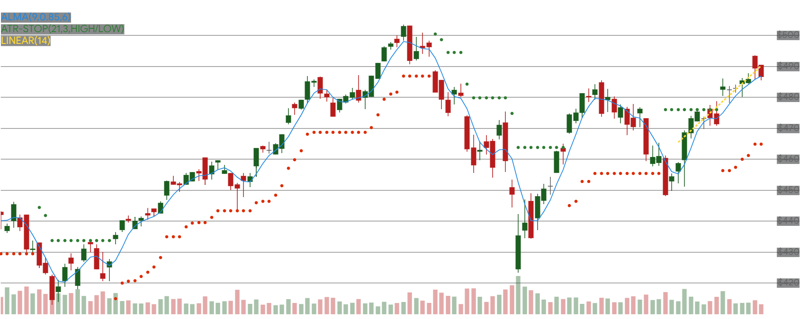

<!-- <p style="text-align:center;">
<a href="https://www.nuget.org/packages/Skender.Stock.Indicators" aria-label="Get the NuGet package." class="not-mobile"></a>
<a href="https://www.nuget.org/packages/Skender.Stock.Indicators" aria-label="Read more about package downloads." class="not-mobile"></a>
</p> -->

# Overview

**Stock Indicators for .NET** is a C# [library package](https://www.nuget.org/packages/Skender.Stock.Indicators) that produces financial market technical indicators.  Send in historical price quotes and get back desired indicators such as moving averages, Relative Strength Index, Stochastic Oscillator, Parabolic SAR, etc.  Nothing more.

Build your technical analysis, trading algorithms, machine learning, charting, or other intelligent market software with this library and your own [OHLCV](pages/guide.md#historical-quotes) price quotes sources for equities, commodities, forex, cryptocurrencies, and others.  [Stock Indicators for Python](https://python.stockindicators.dev/) is also available.

Explore more information:

- [Indicators and overlays](pages/indicators.md)
- [Guide and Pro tips](pages/guide.md)
- [Utilities and helper functions](pages/utilities.md)
- [Demo site](https://charts.stockindicators.dev/) (a stock chart)
- [Example usage code](examples/README.md)
- [Release notes](https://github.com/DaveSkender/Stock.Indicators/releases)
- [Discussions](https://github.com/DaveSkender/Stock.Indicators/discussions)
- [Contributing guidelines](contributing.md)

## Reputable indicators

You'll get all of the industry standard indicators out-of-the-box.  Additionally, you can create compatible [custom indicators](examples/CustomIndicators/README.md).




## Easy to use in your application

```csharp
// example: get 20-period simple moving average
IEnumerable<SmaResult> results = quotes.GetSma(20);
```

See more [usage examples](pages/guide.md#example-usage).

## Use chaining for unique insights

Optional chaining enables advanced uses cases; such as, indicator of indicators, [slope](pages/indicators.md) (direction) of any result, or [moving average](pages/indicators.md) of an indicator.

```csharp
// example: advanced chaining (RSI of OBV)
IEnumerable<RsiResult> results
  = quotes
    .GetObv()
    .GetRsi(14);

// example: use any candle variant
IEnumerable<EmaResult> results
  = quotes
    .Use(CandlePart.HL2)
    .GetEma(20);
```

See the [guide](pages/guide.md) and the [full list of indicators and overlays](pages/indicators.md) for more information.

## Optimized for modern .NET

Our [NuGet library](https://www.nuget.org/packages/Skender.Stock.Indicators) directly targets all current frameworks for peak performance, including the .NET Standard for older framework compatibility.

- .NET 8.0, 7.0, 6.0
- .NET Standard 2.1, 2.0

The compiled library package is [Common Language Specification (CLS) compliant](https://docs.microsoft.com/en-us/dotnet/standard/common-type-system) and can be used in other programming languages, including Python and everything in the .NET universe.

## Licensed for everyone

<a href="https://opensource.org/licenses/Apache-2.0"></a>

This repository uses the standard Apache 2.0 open-source license.  Please review the [license](https://opensource.org/licenses/Apache-2.0) before using or contributing to the software.

## Share ideas with the community

**Need help?**  Have ideas?  [Start a new discussion, ask a question &#128172;](https://github.com/DaveSkender/Stock.Indicators/discussions), or [submit an issue](https://github.com/DaveSkender/Stock.Indicators/issues) if it is publicly relevant.  You can also direct message [@daveskender](https://twitter.com/messages/compose?recipient_id=27475431).

## Give back with patronage

Thank you for your support!  This software is crafted with care by unpaid enthusiasts who &#128150; all forms of encouragement.  If you or your organization use this library or like what we're doing, add a &#11088; on the [GitHub Repo](https://github.com/DaveSkender/Stock.Indicators) as a token of appreciation.

If you want to buy me a beer or are interested in ongoing support as a patron, [become a sponsor](https://github.com/sponsors/facioquo).  Patronage motivates continued maintenance and evolution of open-source projects, and to inspire new ones.

## Contribute to help others

This NuGet package is an open-source project [on GitHub](https://github.com/DaveSkender/Stock.Indicators).  If you want to report bugs or contribute fixes, new indicators, or new features, please review our [contributing guidelines](contributing.md) and [the backlog](https://github.com/users/DaveSkender/projects/1).

Special thanks to all of our community code contributors!

```html
<!-- FIX CONTRIBUTOR GENERATOR -->
<ul class="list-style-none">

  <li class="d-inline-block">
     <a href="{{ contributor.html_url }}" width="75" height="75"></a>
  </li>

</ul>
```

&#187; see our [full list of indicators and overlays](pages/indicators.md)
